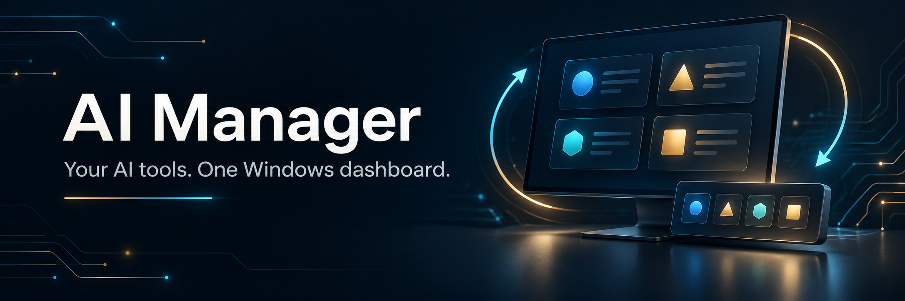
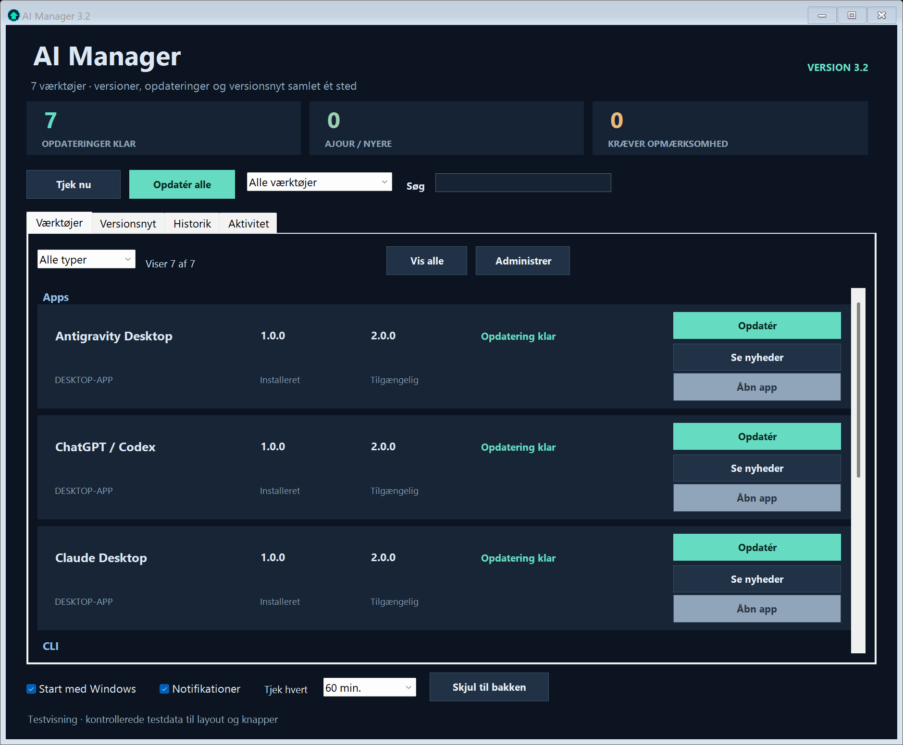
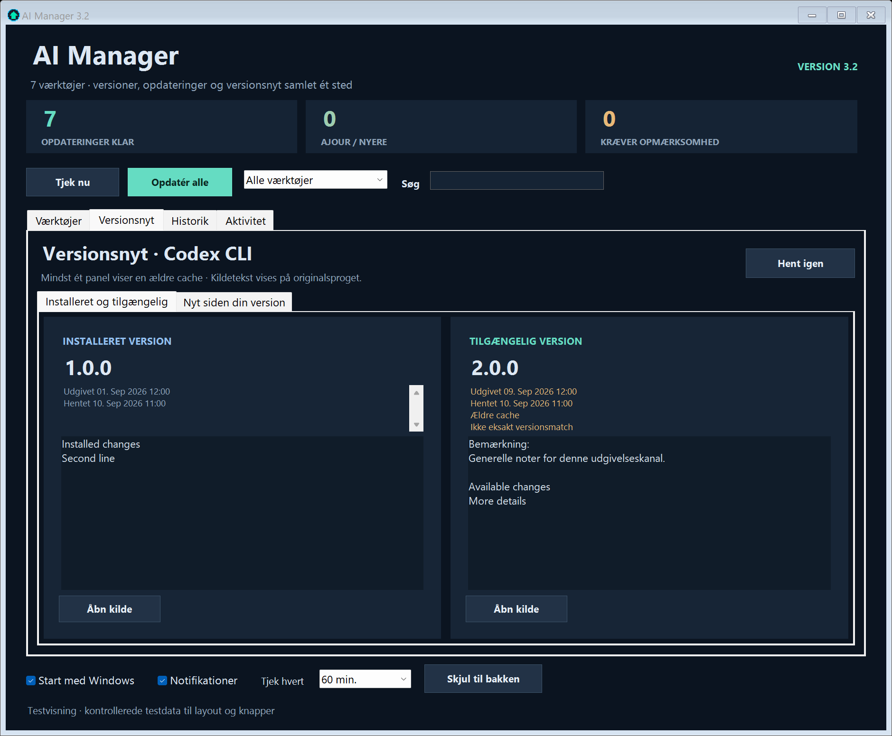
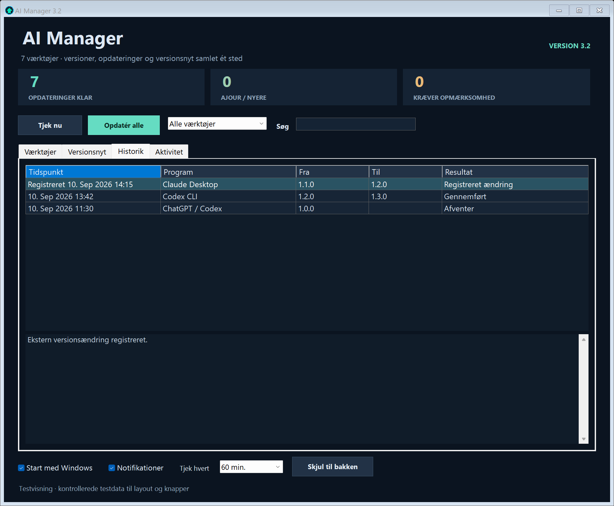

# AI Manager for Windows



AI Manager is a native PowerShell 7 and WinForms tray application that puts version checks, release notes, explicit updates, and local update history for common AI tools in one dashboard.

The application interface is currently **in Danish**. This README and the full English guide explain every control; a complete Danish guide is also included.

## What it manages

The built-in catalog covers:

- Antigravity CLI, Codex CLI, Claude Code, and GitHub CLI
- Antigravity Desktop, Claude Desktop, and the ChatGPT / Codex Windows app
- Additional WinGet or Microsoft Store packages that you add in the dashboard

AI Manager separates checking from updating. **Check now** reads installed and published versions; it never installs anything. An update begins only after you press an update button. A successful installer exit is still insufficient on its own: AI Manager reads the installed version again and reports success only when the requested version, or a newer one, is confirmed.

## Dashboard



The dashboard groups desktop apps and command-line tools, supports search and filters, and distinguishes updates, current or newer installations, missing tools, and states that need attention.



Release notes show the installed version, the available version, and the changes between them when the publisher sources can provide that detail.



The screenshots above are actual WinForms renders produced by `tests/test-ui.ps1`. Their versions and history entries are controlled synthetic test data; they do not describe a real computer.

## Requirements

- Windows with Windows Forms and Task Scheduler available
- PowerShell 7, installed using its Microsoft Store app alias or the default MSI location (`%ProgramFiles%\PowerShell\7\pwsh.exe`)
- WinGet for desktop-app and GitHub CLI package operations
- Network access to publisher version and release-note sources when checking

No specific Windows release is claimed here because the public package has not been validated across a Windows version matrix.

The silent launcher and autostart helper look in those two PowerShell locations. For a portable PowerShell installation, launch the main script directly with that installation's `pwsh -NoProfile -STA -File .\ai-tray-updater.ps1`; the bundled autostart helper does not discover arbitrary portable paths.

## Quick Start

1. Download the repository as a ZIP and extract it to a folder you intend to keep, or clone it with Git.
2. Confirm the prerequisites:

   ```powershell
   pwsh --version
   winget --version
   ```

3. Start the dashboard by double-clicking `start-tray.cmd`, or from PowerShell:

   ```powershell
   .\start-tray.cmd
   ```

4. Press **Tjek nu** to perform a read-only version check.
5. Review the result and release notes before pressing **Opdatér** for one tool or **Opdatér alle** for all confirmed updates.

Closing the window hides AI Manager in the notification area. Use **Afslut** in its tray menu to end it.

## Read-only command-line check

This command checks versions without opening the graphical interface and without updating software:

```powershell
pwsh -NoProfile -NonInteractive -File .\ai-tray-updater.ps1 -CheckNowAndExit
```

Add `-Json` for machine-readable output. Exit code `2` means at least one result was unknown or errored; it does not mean an update ran.

## Start with Windows

Autostart is optional. It creates a per-user Scheduled Task named `AI-CLI-Updater`; no password is stored and the task runs with limited rights 15 seconds after interactive sign-in.

```powershell
# Inspect only
pwsh -NoProfile -File .\manage-startup.ps1 -Action status

# Enable
pwsh -NoProfile -File .\manage-startup.ps1 -Action enable

# Disable
pwsh -NoProfile -File .\manage-startup.ps1 -Action disable
```

Disabling autostart does not close a running manager and leaves the Scheduled Task registered in a disabled state. See the [English guide](docs/GUIDE.md#10-remove-ai-manager) or [Danish guide](docs/GUIDE.da.md#10-fjern-ai-manager) for exact removal steps.

The task name is shared at machine level. Before enabling or disabling it, the helper verifies that both its principal and sign-in trigger belong to the current user. A task owned by another account is left unchanged; simultaneous autostart configurations for multiple accounts are not supported.

## Local data and network behavior

Runtime state is stored under `%LOCALAPPDATA%\Hovborg\AI-Manager` by default. It includes settings, bounded logs, local history, observed versions, release-note cache, runtime status, and a notification icon. You can pass `-StateDirectory` to the main script for an isolated location.

Version checks contact the configured publisher endpoints and WinGet sources. AI Manager does not download or execute replacement scripts for itself. When you explicitly request a package update, it runs the tool's own updater or a fixed, non-interactive WinGet upgrade command and then verifies the installed version.

## Documentation and tests

- [Full guide in English](docs/GUIDE.md)
- [Komplet guide på dansk](docs/GUIDE.da.md)
- [Contributing](CONTRIBUTING.md)

Run the safe synthetic suite from a PowerShell 7 prompt:

```powershell
pwsh -NoProfile -NonInteractive -File .\tests\test-public-package.ps1
pwsh -NoProfile -NonInteractive -STA -File .\tests\test-all.ps1
```

The suite uses mocks, temporary directories, controlled loopback HTTP, and synthetic WinForms data. It does not invoke the live manager, install packages, enable autostart, or query installed tool versions. Tests write ignored evidence under `artifacts/`; remove that directory before packaging a release.

## License and attribution

The original code and bundled icon are licensed under the [MIT License](LICENSE), copyright © 2026 Brian Hovborg.

The cover image is AI-generated illustrative artwork. The screenshots in the guide are rendered from the actual application using fictional test data.

PowerShell, Windows, WinGet, ChatGPT, Codex, Claude, Antigravity, and GitHub are names or trademarks of their respective owners. They are referenced to describe interoperability. This project is independent and is not endorsed by Microsoft, OpenAI, Anthropic, Google, or GitHub.
